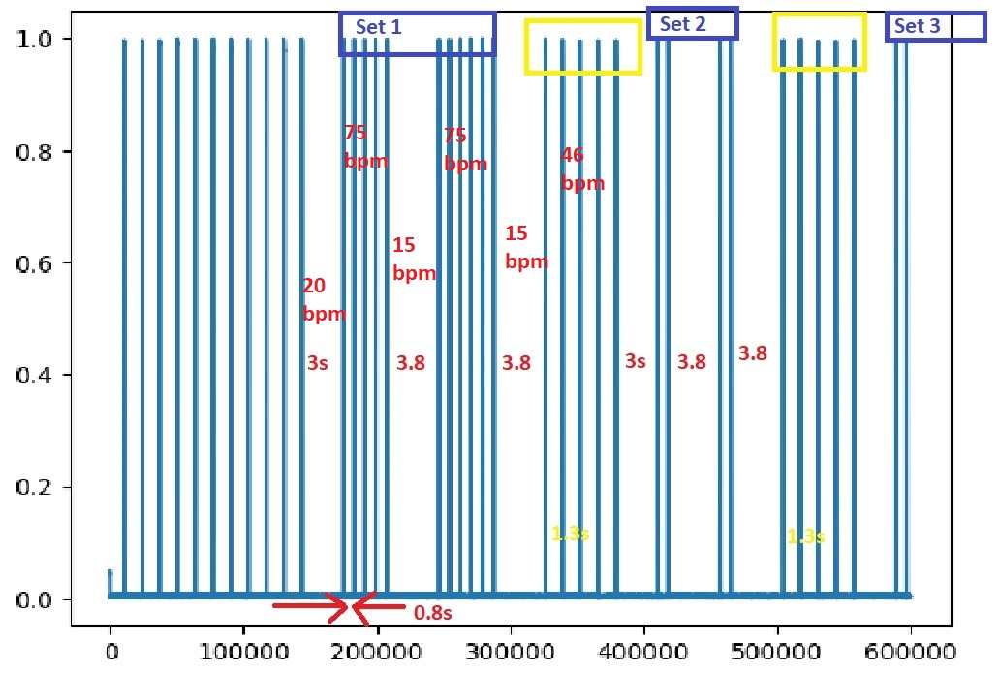
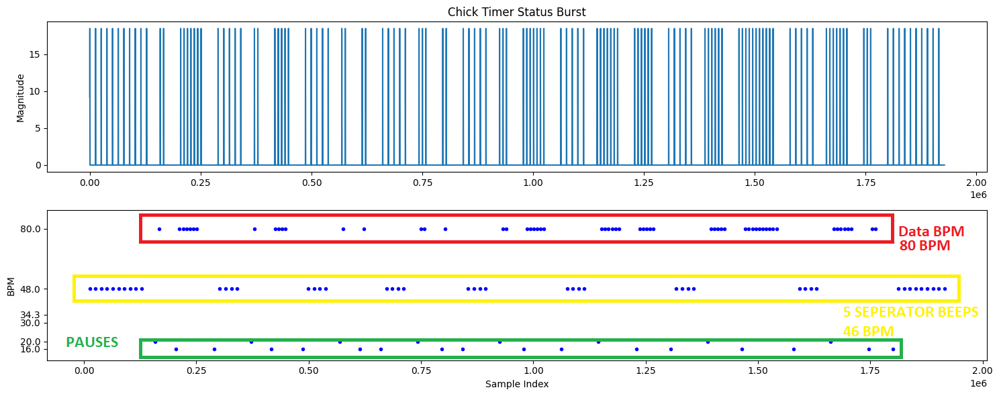

## Chick Timer (CT) mode:

Each transmitter spends most of its time in background beep rate (80/48/30 BPM).
Once every 10 minutes a different set of beeps is emitted that tells us more information 
about the bird. When the transmitter does this it is called CT mode.

The start of CT mode is marked by a different beep rate (20 BPM) marks the start 
of 8 pairs of numbers transmitted 1 integer at a time.

Each set of numbers is transmitted at the next beep rate higher than 
the background beep rate with a 15BPM pause between each digit. (So if background was 
30 then the CT data beeps are at 48, if background is 48 then data beeps are at 80, 
if background is 80, data beeps are also at 80BPM)

After the second integer in a pair, there is another 15BPM pause before the 5 beep seperator which is transmitted at 46BPM.
Then  20BPM pause and the next set of digits...

...

Until the 8th set of digits when the beep rate returns to background.

By way of background these numbers mean:

    days_since_change_of_state
    days_since_hatch
    days_since_desertion_alert
    time_of_emergence
    weeks_batt_life_left
    activity_yesterday
    activity_two_days_ago
    mean_activity_last_four_days

Expressed in BPM it might look like this:

- `80-80-80-80-80-80-80-` (Background)
- `20-` (CT start)
- `80-80-80-` (First digit first pair "3")
- `-15-` (inter digit seperator)
- `80-80-80-80-` (Second digit first pair "4")
- `-15-` (digit seperator)
- `46-46-46-46-` (5 separator beeps)
- `20-` (marks the start of second set of digits)
- `80-80` (First digit second pair "2")
- `-15-` ( inter digit seperator)
- `-80-80-` (Second pair second digit "2")
- etc. etc. etc.

So in the above example we were in background mode of 80BPM, then got a 20BPM 
start/seperator then it transmitted "3" and then "4" so days_since_change_of_state = "34"

Then we got 5 separator beeps (at 46BPM), a 20BPM pause and the next 
set of digits "2" and "2" so days_since_hatch = "22" etc.

Now if the signal is weak and it misses a beep the whole thing aborts and waits
another ten minutes.

If it completes all 8 pairs of digits in the sequence expected, then it can 
print out the complete CT class (which also has some other information attached, 
date time start/finish and GPS etc.)

Validation:

 - You can not have a 0 or a 1 (its impossible to have 0 beeps)
 
 Maximum Values:

| Attribute | Max Fast Telemetry | Audible Telemetry | Max Beeps Pair 1 | Max Beeps Pair 2 |
|-----------|--------------------|-------------------|------------------|------------------|
|days_since_change_of_state  | 99 | 255 | 27 | 7 |
|days_since_hatch | 99 |255 | 
|days_since_desertion_alert | 99 | 255 | 
|time_of_emergence | N/A | 99 | 255 |
|weeks_batt_life_left | 52 | 52 |
|activity_yesterday | 99 | 144 |
|activity_two_days_ago | 99 |144 |
|mean_activity_last_four_days | 99 | 144 |
